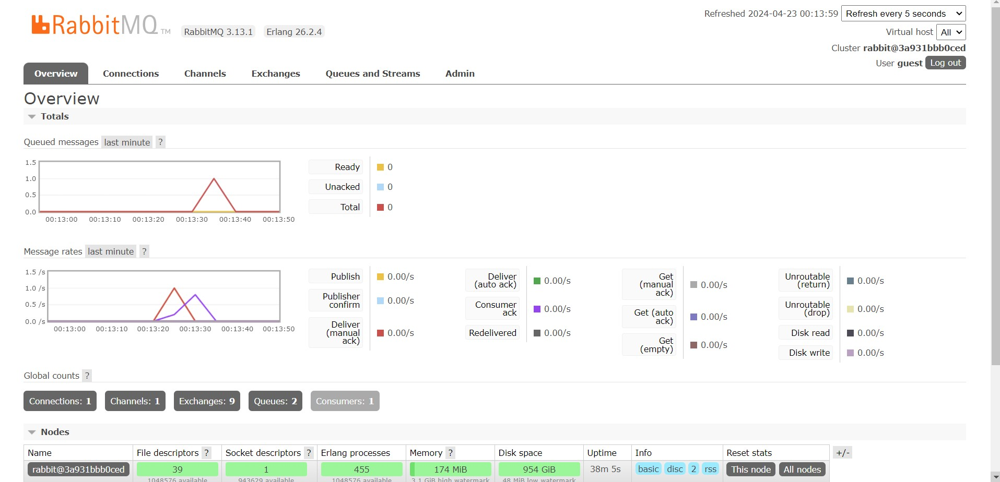
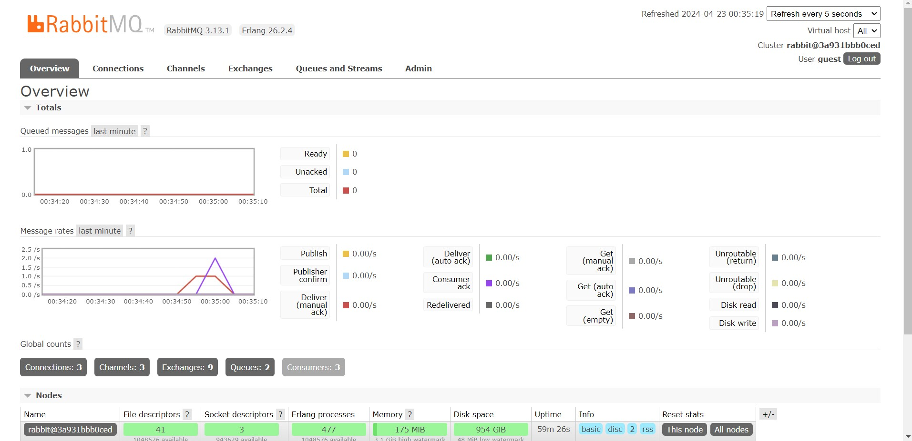

# Simulation slow subscriber

Mine is 1. When I introduced a one-second delay in the subscriber's message processing by uncommenting `thread::sleep(ten_millis);`, it caused the subscriber to consume messages more slowly than they were being published.  The queue size increased to 1 because the publisher continuously sends messages at a faster rate than the subscriber can handle them. However, since the queue size is relatively small, it suggests that the timing of my observations in the RabbitMQ management interface or the frequency of message publication was such that the queue never accumulated more than one message at a time before it was consumed by the subscriber. This results in a consistently low queue size, increasing from zero to one, reflecting the new balance between message publication and the delayed consumption rate.

# Reflection and Running at least three subscribers

Each subscriber I added runs in parallel and independently consumes messages from the same queue. This parallel processing drastically increases the overall throughput of your system. As a result, even if each subscriber individually introduces a delay (as simulated by thread::sleep(ten_millis);), collectively, they manage to process messages faster than a single subscriber. Hence, the message queue length decreases more rapidly, and any spikes in the queue caused by bursts of incoming messages from the publisher are mitigated more effectively. This is evidenced by Tutorial explanation and mine exploration that different subscribers are handling different messages, such as one handling "Budi" and "Dira," while another processes "Amir," "Cica," and "Emir.". Based on my readings, the code could implement dynamic scalling. Depending on the workload, the number of subscribers could be dynamically adjusted. It is because by implementing a system that monitors queue length and automatically spins up more subscribers when the queue gets too long could help maintain optimal processing times.
Source : https://www.alibabacloud.com/blog/scheduled-scaling-vs--dynamic-scaling-what-is-the-best-choice_598412
